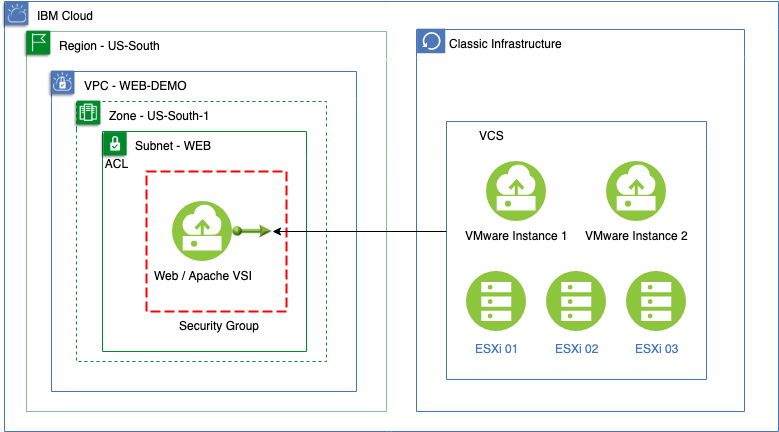

# Use Use GUI, CLI or API to Connect an App deployed within VPC to a VCS deployment outside VPC
### Purpose
This scenario consider a sample application deployed inside a regular VSI within a VPC, a VCS Cluster with at least one virtual machine (VMware based) and a connection framework between the two.

## VPC Functional Coverage
| Function | Result | Notes |
| -------- | ------ | ----- |
| VPC | :white_check_mark: | |
| Floating IPv4 | :white_check_mark: | |
| Subnet & BYO Private IP | :white_check_mark: | |
| Dedicated VSI support | :white_check_mark: | |
| Multiple Network Interfaces in VSI | :white_check_mark: | |
| Linux VSI support | :white_check_mark: | |
| Security groups | :white_check_mark: | |

### Architecture

* [Deploy using UI](UI)

* [Deploy using CLI](CLI)

* [Deploy using API](API)
